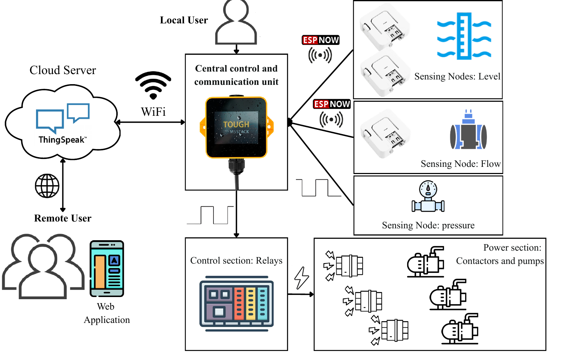
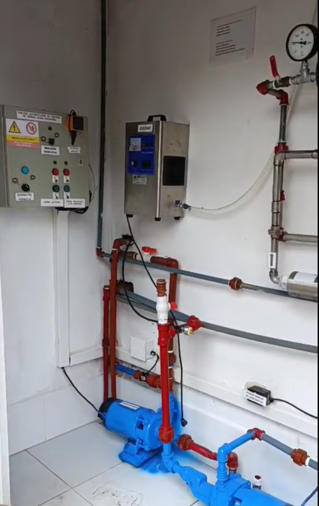

# Low-Cost IoT Automation for Desalination in the Galápagos

Field retrofit of a small reverse-osmosis plant in Santa Cruz Island using an ESP32-based M5Stack Tough controller, distributed ESP-NOW sensor nodes, relay/contactor actuation, and ThingSpeak supervision.



## What is included

- `firmware/`: concise MicroPython reference implementation for the central controller, flow node, and tank-level node.
- `data/`: a small, anonymized operational window exported from ThingSpeak.
- `analysis/`: a dependency-free script that summarizes the sample data and checks the low-pressure-to-high-pressure sequence.
- `assets/`: architecture, control logic, and photographs of the plant.

## Demonstration video

[▶ Watch the automation video](https://www.youtube.com/shorts/4TdXMVcsPnM)

> Replace `REPLACE_WITH_VIDEO_ID` with the final public or unlisted video identifier.

## System overview

1. Flow and level nodes acquire local measurements and send them to the central controller through ESP-NOW.
2. The controller executes the safety logic locally, so pump protection does not depend on Internet availability.
3. Relay outputs command the existing power contactors for the inlet, low-pressure, and high-pressure pumps.
4. Wi-Fi and ThingSpeak are used for remote visualization, historical storage, and assisted supervision.



## Quick start

```bash
git clone https://github.com/USERNAME/galapagos-iot-desalination.git
cd galapagos-iot-desalination
python analysis/summarize_sample.py
```

For the embedded devices, copy each `config.example.py` file as `config.py`, enter the local pins, MAC addresses, Wi-Fi credentials, and ThingSpeak key, and then upload the corresponding folder to the ESP32 device.

## Data-field mapping

The public sample preserves the asynchronous ThingSpeak structure. Based on the operational traces and manuscript description:

| Field | Working interpretation |
|---|---|
| `field1` | Main-tank level converted to an estimated stored volume; verify against the original channel configuration |
| `field3` | Primary monitored flow in L/min |
| `field6` | Controller event/state code |

State codes used in the sample are `1` inlet pump ON, `2` inlet pump OFF, `3` low-pressure pump ON, `4` RO train OFF, and `6` high-pressure pump ON.

## Important note

The repository firmware is a **sanitized reference implementation reconstructed from the deployed architecture and control logic**. The original production source code was not contained in the supplied files. Before field deployment, verify relay polarity, GPIO assignments, sensor calibration, electrical isolation, emergency stops, tank limits, and all pump protections with qualified personnel.

## Citation

Please cite the associated manuscript listed in `CITATION.cff`.

## License

MIT License. Photographs and research data remain subject to the authors' attribution and data-use conditions.
